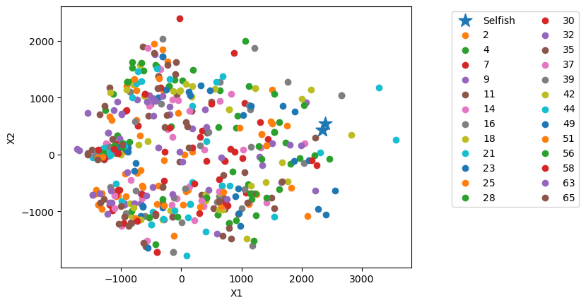
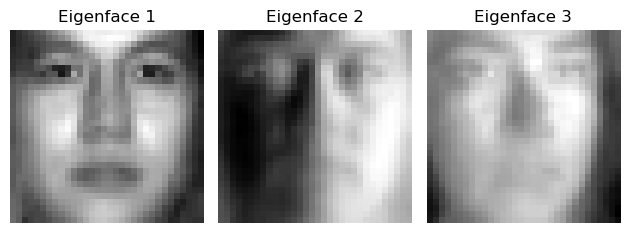

# EE5907 Pattern recognition CA2 Report

## 0. Dataset selection

The formula for select 25 subjects:

```python
choice = [i * 7 % 68 for i in range(1, 25 + 1)]
```

Since 7 is a prime root of 68, no one will be repeated. And the detailed choice is shown as following:

```bash
[2, 4, 7, 9, 11, 14, 16, 18, 21, 23, 25, 28, 30, 32, 35, 37, 39, 42, 44, 49, 51, 56, 58, 63, 65]
```


## 1. PCA based data distribution visualization

### 1.1 Projected data vector in 2d. 

>  The projected points corresponding to my photo are those star marks



### 1.2 Projected data vector in 3d

>  The projected points corresponding to my photo are those star marks


### 1.3 Visualize the corresponding 3 eigenfaces 




## 2. PCA plus nearest neighbor classification results

1. Training PCA and nearest neighbor with the **sampled 500** images

```latex
Dimension 40: Accuracy on PIE = 0.4584615384615385
Dimension 40: Accuracy on Selfish = 1.0

Dimension 80: Accuracy on PIE = 0.4976923076923077
Dimension 80: Accuracy on Selfish = 1.0

Dimension 200: Accuracy on PIE = 0.5107692307692308
Dimension 200: Accuracy on Selfish = 1.0
```

2. Training PCA and nearest neighbor with the **whole** training set

```latex
Dimension 40: Accuracy on PIE = 0.9115384615384615
Dimension 40: Accuracy on Selfish = 1.0

Dimension 80: Accuracy on PIE = 0.9338461538461539
Dimension 80: Accuracy on Selfish = 1.0

Dimension 200: Accuracy on PIE = 0.9415384615384615
Dimension 200: Accuracy on Selfish = 1.0
```


## 3. LDA based data distribution visualization

1. Visualize distribution of the sampled data with dimensionality of 2 


2. Visualize distribution of the sampled data with dimensionality of 3


## 4. LDA plus nearest neighbor classification results

The classification accuracy for data with dimensions of 2, 3 and 9 on the PIE test set and my own selfish photo.

```latex
Dimension 2: Accuracy on PIE = 0.35307692307692307
Dimension 2: Accuracy on Selfish = 1.0

Dimension 3: Accuracy on PIE = 0.5638461538461539
Dimension 3: Accuracy on Selfish = 1.0

Dimension 9: Accuracy on PIE = 0.9092307692307692
Dimension 9: Accuracy on Selfish = 1.0
```


## 5. SVM classification results with different parameter values

### 5.1 The classification accuracy with different parameters and dimensions

#### 5.1.1 Raw face images (vectorized) as inputs to linear SVM

```latex
Raw image vectorized, C: 0.01
Accuracy = 98.5418% (1284/1303) (classification)
------------------------------------------------------------
Raw image vectorized, C: 0.1
Accuracy = 98.5418% (1284/1303) (classification)
------------------------------------------------------------
Raw image vectorized, C: 1
Accuracy = 98.5418% (1284/1303) (classification)
------------------------------------------------------------
```

#### 5.1.2 The face vectors after PCA pre-processing (with dimensionality of 80 and 200) as inputs to linear SVM

```latex
Dimension: 80, C: 0.01
Accuracy = 98.1581% (1279/1303) (classification)
------------------------------------------------------------
Dimension: 80, C: 0.1
Accuracy = 98.1581% (1279/1303) (classification)
------------------------------------------------------------
Dimension: 80, C: 1
Accuracy = 98.1581% (1279/1303) (classification)
------------------------------------------------------------
Dimension: 200, C: 0.01
Accuracy = 98.6186% (1285/1303) (classification)
------------------------------------------------------------
Dimension: 200, C: 0.1
Accuracy = 98.6186% (1285/1303) (classification)
------------------------------------------------------------
Dimension: 200, C: 1
Accuracy = 98.6186% (1285/1303) (classification)
------------------------------------------------------------
```

| Dimension | C    | Accuracy |
| --------- | ---- | -------- |
| 80        | 0.01 | 98.1581% |
| 80        | 0.1  | 98.1581% |
| 80        | 1    | 98.1581% |
| 200       | 0.01 | 98.6186% |
| 200       | 0.1  | 98.6186% |
| 200       | 1    | 98.6186% |
| Raw image | 0.01 | 98.5418% |
| Raw image | 0.1  | 98.5418% |
| Raw image | 1    | 98.5418% |

### 5.2 Discuss the effect of data dimension and parameter C on the final classification accuracy

We can notice that when we increased the dimensionality, the accuracy raised a little bit, and when we used the raw image vectorized data, the accuracy even fell down. Besides, when we adjusted *C*, and the accuracy remains unchanged. The following is the discussion on these two phenomenons. 

#### Increase in Accuracy with Higher Dimensions from 80 to 200 & Decrease when using raw image vectorized data

1. **Information Retention**: As we increased the dimensionality, more information from the original data is preserved. This added information can be crucial for distinguishing between classes, thus improving accuracy.
2. **Balance in Dimensionality**: The initial increase in dimensions might be capturing essential features that were previously ignored in the low dimension project. However, it's also worth-noticing that beyond a certain point, adding more dimensions could introduce noise or irrelevant information, which might not further improve or could even decrease accuracy. And in our case, the raw image vectorized data may include certain noise, causing the decrease in accuracy.

#### Minimal Effect of changing the regularization parameter C

1. **Dataset Characteristics**: With little effect of changing C on accuracy, it might reveal the original data is either well-separated or, conversely, have too noise or outliers that the margin adjustments by C cannot significantly import the decision boundary. In our case, as the accuracy remains the same under the same C value, it suggests that it might always be the same few items that are misclassified. Therefore, it's possible that our dataset contains some outliers.
2. **Parameter Sensitivity**: It is also likely that the range of chosen is not wide enough, or our dataset does not have a high sensitivity to this parameter due to its charateristics as stated in the last point. 
3. **Model Complexity vs. Regularization**: In addition, the model performs relatively well across these values of C, and it is possible that the complexity of the model is not the limitation for performance in our case.

And theoretically speaking, **Effect of Parameter C in SVM**

- **High C**: Aims for a lower training error with less tolerance for misclassification, potentially leading to overfitting.
- **Low C**: Increases tolerance for misclassification, resulting in a simpler decision boundary but might underfit the data.


## 6. CNN classification results

1. The **final** classification performance on the **testing** set:

```tex
The accuracy on the testing set: 98.70%
```

2. In each training epoch, loss and accuracy on the **training** set:

```tex
Epoch  1, Loss: 3.18, Accurcy: 8.45%
Epoch  2, Loss: 1.62, Accurcy: 58.30%
Epoch  3, Loss: 0.46, Accurcy: 88.06%
Epoch  4, Loss: 0.22, Accurcy: 94.72%
Epoch  5, Loss: 0.20, Accurcy: 94.62%
Epoch  6, Loss: 0.10, Accurcy: 97.57%
Epoch  7, Loss: 0.07, Accurcy: 98.51%
Epoch  8, Loss: 0.04, Accurcy: 99.32%
Epoch  9, Loss: 0.03, Accurcy: 99.63%
Epoch 10, Loss: 0.02, Accurcy: 99.59%
Epoch 11, Loss: 0.02, Accurcy: 99.70%
Epoch 12, Loss: 0.01, Accurcy: 99.80%
Epoch 13, Loss: 0.01, Accurcy: 99.93%
Epoch 14, Loss: 0.01, Accurcy: 99.97%
Epoch 15, Loss: 0.01, Accurcy: 99.97%
```

